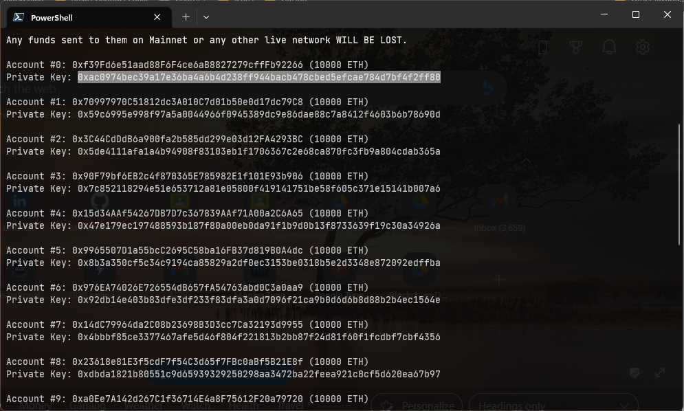
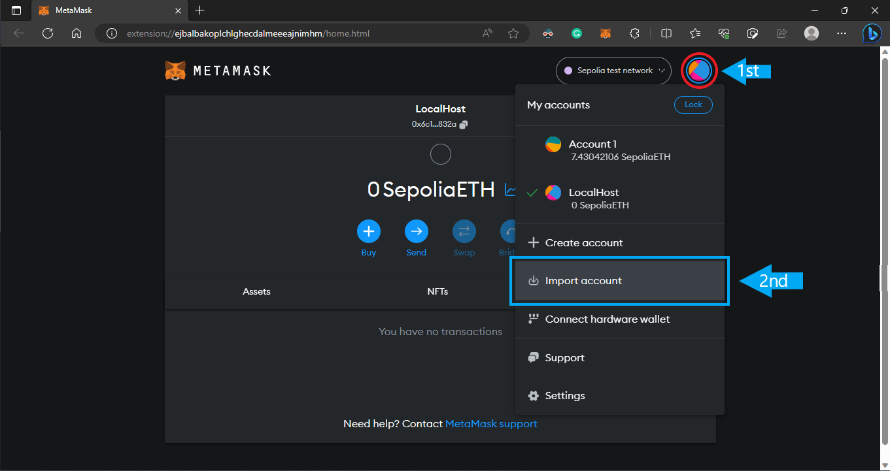
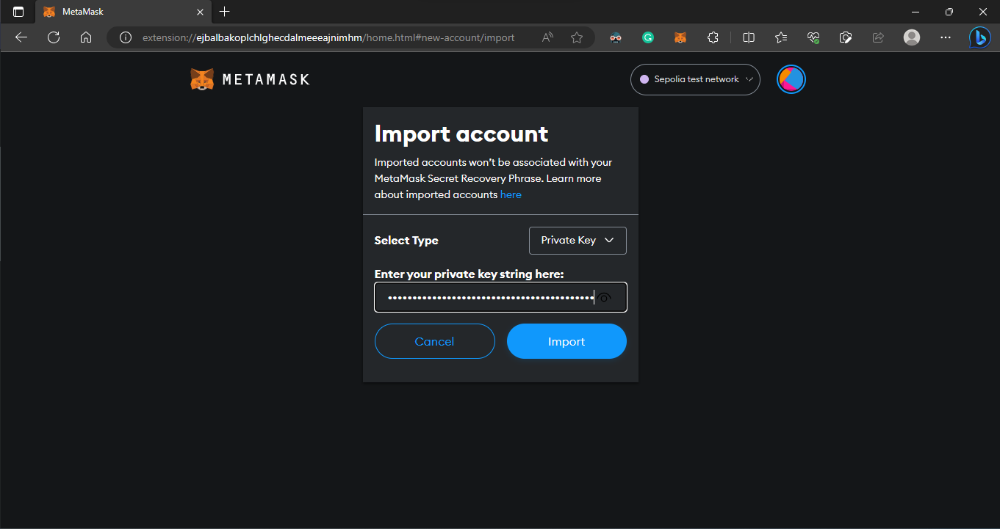
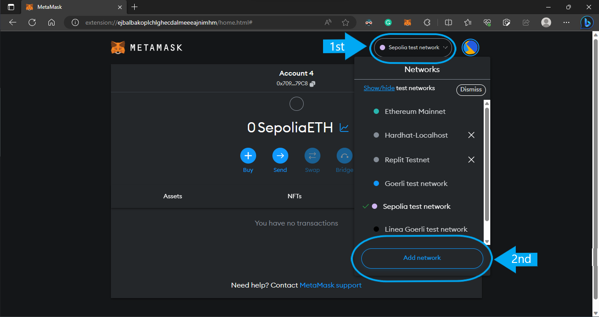
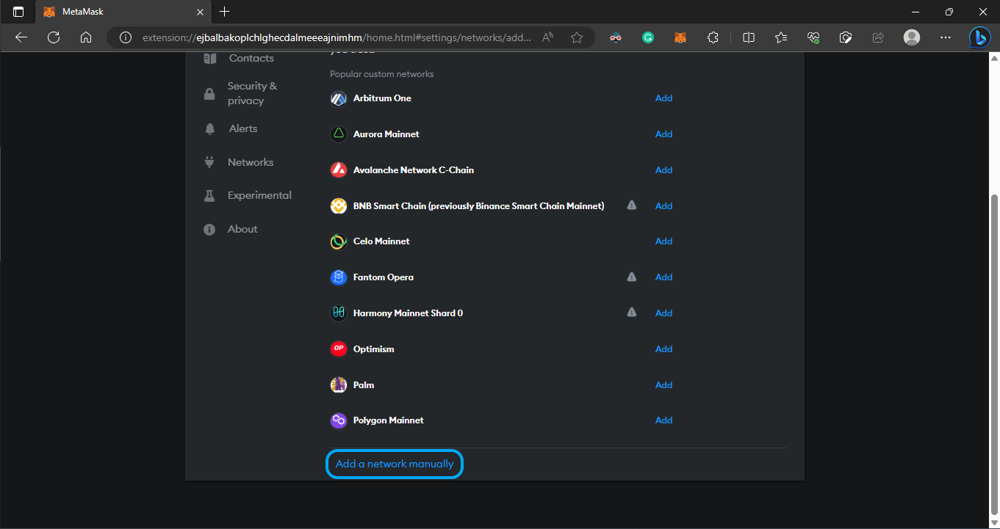
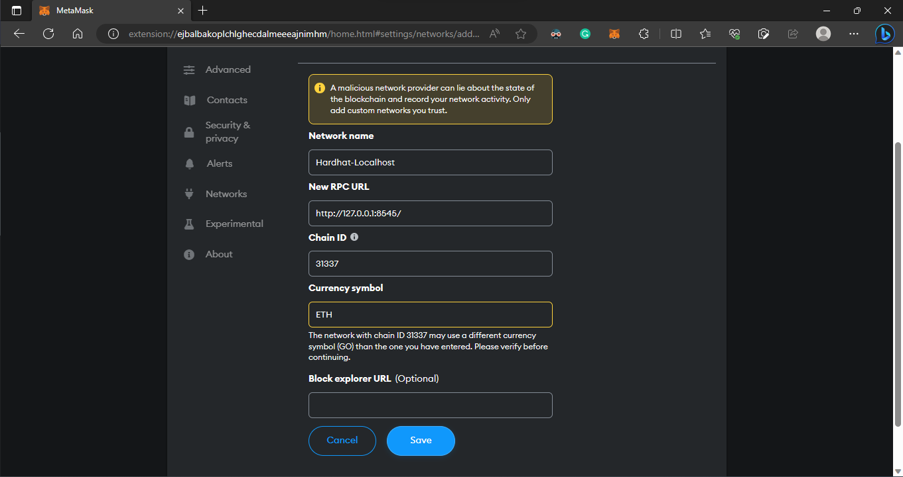
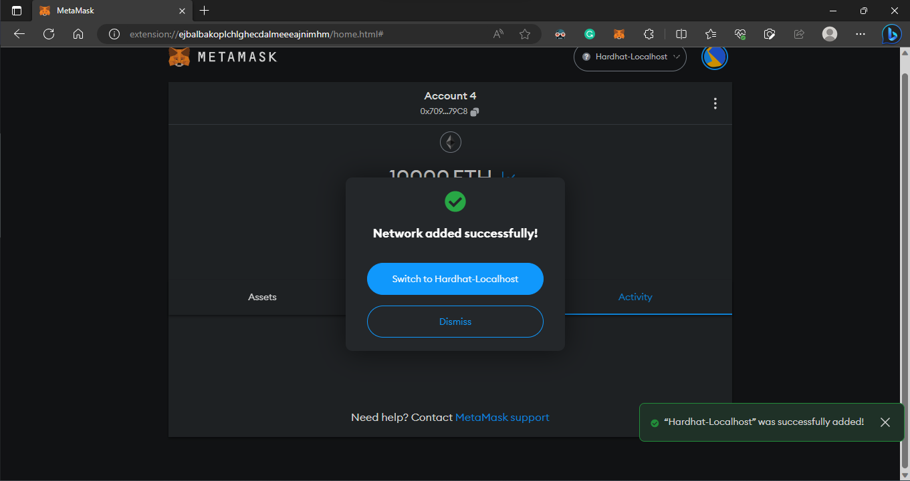

    <h1 align="center">How to add Local Nodes in Metamask</h1>

- First go to the `BackEnd` folder and run: `yarn hardhat node` It will run a local blockchain with 20 nodes. All the nodes `public key` `private key` `balance` can be seen here. Copy the private key of `Account-0`

- Open metamask in the browser and click on the red circle `denoted 1st` then click `Import account` `denoted 2nd`

- Then paste the private key here and click `Import`

- Similarly import `Account-1`

- Then click on the `1st` circle then click the `2nd` circle which says `Add network`

- Then click `Add network manually` on the bottom

- After that fill up all the information as shown in the picture and click `save`

- A prompt will come up click `Switch to Hardhat-Localhost`

